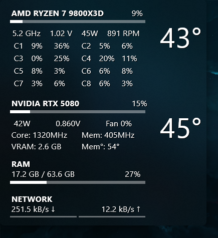

# SSyl-HWiNFO - System Monitor for Rainmeter

A system monitoring widget for Rainmeter that displays hardware information using HWiNFO (via Rainmeter's built-in plugin) in a clean, modern interface. The blur effect is made using the [FrostedGlass](https://github.com/TheAzack9/FrostedGlass) plugin by TheAzack9.



## Features

- **CPU Monitoring**: Temperature, load, frequency, voltage, power consumption, and individual core/thread utilization
- **GPU Monitoring**: Temperature, load, power, voltage, core/memory clocks, fan speed, and VRAM usage  
- **RAM Usage**: Memory consumption with percentage and usage bars
- **Network Activity**: Real-time upload/download speeds with visual indicators
- **Modern Design**: Transparent background with rounded corners and optional acrylic blur effect
- **Customizable Layout**: Configurable spacing and positioning variables
- **Interactive**: Clickable background with customizable mouse actions

## Requirements

- **Rainmeter 8+**
- **HWiNFO64/32** - Hardware monitoring software
- **FrostedGlass Plugin** (optional, but you'll have to edit the "Combined" file to disable Frosted Glass) - For Windows 10/11 acrylic blur effects

## Setup

1. Install [HWiNFO64](https://www.hwinfo.com/)
2. In Sensor Settings, go to the HWiNFO Gadget tab and select each sensor you need (as defined in `Combined.ini`)
2. Configure HWiNFO to output the sensors you want to monitor
3. Download and extract this skin to your Rainmeter Skins folder
4. Right-click the skin and select "Display Sensors" to get sensor #s.
5. Edit the sensor index variables in `Combined.ini` to match your hardware
6. Load and/or refresh the Combined skin in Rainmeter

## Configuration

Edit the `[Variables]` section in `Combined.ini` to customize:

- **HWiNFO Sensor Indices**: Match these to your specific hardware sensors
- **Network Speeds**: Set your internet connection speeds for proper scaling
- **Layout Variables**: Adjust spacing, positioning, and grid layout
- **Mouse Actions**: Customize background click behaviors

## File Structure

```
SSyliNFO/
├── Combined/
│   └── Combined.ini          # Main combined widget
├── CPU/
│   └── CPU_Extended.ini      # Individual CPU widget  
├── GPU/
│   └── GPU.ini              # Individual GPU widget
├── RAM/
│   └── RAM.ini              # Individual RAM widget
├── Network/
│   ├── Download.ini         # Download speed widget
│   └── Upload.ini           # Upload speed widget
└── ShowReg/
    ├── ShowReg.ini          # Sensor display utility
    └── HWiNFORegistryReader.lua
```

## Customization

The skin supports extensive customization through layout variables:
- `CoresPerRow`: Number of CPU cores displayed per row
- `RowSpacing`: Vertical spacing between core rows  
- `CoreSpacing`: Horizontal spacing between core groups
- `ThreadSpacing`: Spacing between individual thread displays

## License

Creative Commons BY-SA 4.0

## Credits

- Based on HWiNFO integration methods from the Rainmeter community
- [FrostedGlass](https://github.com/TheAzack9/FrostedGlass) plugin support for modern blur effects (Requires Windows 10/11)